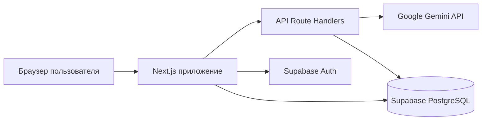

# Техническая документация IQ-67

## 1. Назначение проекта

IQ-67 — веб-тренажёр переговоров для фрилансеров и специалистов, которые продают услуги. Пользователь задаёт данные о себе и заказчике, проводит диалог с ИИ-оппонентом, получает подсказки и итоговую оценку переговоров.

Рабочая версия: [iq-67.vercel.app](https://iq-67.vercel.app/)

## 2. Архитектура



Приложение собрано как единый проект Next.js:

- интерфейс работает в браузере;
- серверные обработчики Next.js скрывают ключ Gemini и обращаются к нейросети;
- Supabase отвечает за регистрацию, вход, профиль и хранение переговорных сессий;
- Vercel собирает и публикует приложение.

## 3. Технологический стек

| Часть системы | Технология |
| --- | --- |
| Интерфейс и сервер | Next.js 16, React 19, TypeScript |
| Стили | CSS Modules / глобальные стили проекта |
| Авторизация и база данных | Supabase Auth, PostgreSQL, Row Level Security |
| Нейросеть | Google Gemini API |
| Развёртывание | Vercel |
| Контроль версий | Git, GitHub |

## 4. Структура проекта

```text
app/                 страницы и серверные API Next.js
  api/chat/          ответ ИИ-оппонента
  api/plan/          подготовка сценария и задач
  api/report/        итоговый разбор переговоров
  api/transcribe/    распознавание голосового сообщения
components/          элементы интерфейса
lib/                 логика приложения и работа с Supabase
public/              статические ресурсы и иконки
supabase/migrations/ миграции базы данных
docs/                документация проекта
```

## 5. Как проходит сессия

1. Пользователь входит в аккаунт и заполняет профиль.
2. На главной странице выбирает сложность и задаёт данные заказчика.
3. Сервер формирует скрытые параметры оппонента, цели и начальную реплику.
4. Пользователь отвечает текстом или голосом.
5. `/api/chat` передаёт Gemini контекст текущей сессии и последние сообщения.
6. Ответ оппонента, состояние задач и снимок хода сохраняются в Supabase.
7. После завершения `/api/report` формирует результат: выигрыш, компромисс или проигрыш, а также рекомендации.
8. История позволяет открыть дерево диалога и создать альтернативную ветку от выбранного хода.

## 6. Логика оценки переговоров

На первом этапе приложение проверяет выявление потребности по SPIN:

- **S — Situation:** пользователь уточнил текущую ситуацию заказчика;
- **P — Problem:** обнаружил проблему или неудобство;
- **I — Implication:** раскрыл последствия проблемы;
- **N — Need-payoff:** выяснил ценность желаемого результата.

Следующие этапы — работа с возражениями и завершение сделки. Состояние этапов хранится вместе со снимком каждого хода, поэтому ветка может быть восстановлена без пересчёта предыдущих реплик.

## 7. База данных

Основные таблицы:

| Таблица | Назначение |
| --- | --- |
| `profiles` | имя, отчество, профессия, услуги, опыт и сильные стороны пользователя |
| `negotiation_sessions` | настройки и состояние переговорной сессии |
| `negotiation_messages` | реплики пользователя и оппонента |
| `negotiation_snapshots` | состояние задач и параметров после каждого хода |

Доступ к пользовательским данным ограничен политиками Row Level Security: авторизованный пользователь видит и изменяет только свои записи.

Миграции применяются в порядке их номеров:

1. `001_negotiation_core.sql` — основные таблицы;
2. `002_session_history_and_branches.sql` — история и ветвление;
3. `003_retention_and_cleanup.sql` — удаление устаревших данных;
4. `004_user_profiles.sql` — пользовательские профили.

Миграция очистки создаёт механизм удаления сессий старше семи дней. Если в проекте Supabase доступен `pg_cron`, очистка запускается ежедневно.

## 8. API

Все обработчики находятся внутри приложения и вызываются по относительным адресам.

### `POST /api/plan`

Создаёт скрытый план переговоров, задачи и стартовые параметры оппонента.

### `POST /api/chat`

Принимает настройки сессии, историю сообщений и новую реплику пользователя. Возвращает ответ оппонента и структурированную оценку текущего хода.

Пример запроса:

```json
{
  "message": "Какой результат для вас будет самым важным?",
  "messages": [],
  "session": {
    "difficulty": "normal"
  }
}
```

### `POST /api/report`

Формирует итог сессии, оценку этапов и советы пользователю.

### `POST /api/transcribe`

Принимает аудиозапись и возвращает распознанный текст. Максимальный размер файла — 8 МБ.

## 9. Переменные окружения

| Переменная | Где используется | Секрет |
| --- | --- | --- |
| `NEXT_PUBLIC_SUPABASE_URL` | подключение к проекту Supabase | нет |
| `NEXT_PUBLIC_SUPABASE_PUBLISHABLE_KEY` | безопасный публичный ключ Supabase | нет |
| `GEMINI_API_KEY` | серверные запросы к Gemini | да |
| `GEMINI_MODEL` | модель для диалогов и анализа | нет |
| `GEMINI_TRANSCRIBE_MODEL` | модель распознавания речи | нет |
| `NEXT_PUBLIC_APP_URL` | публичный адрес приложения | нет |

`GEMINI_API_KEY` нельзя добавлять в Git или передавать в браузерный код. Локально он хранится в `.env.local`, а на Vercel — в разделе Environment Variables.

## 10. Развёртывание на Vercel

1. Импортировать репозиторий GitHub в Vercel.
2. Оставить Framework Preset: **Next.js**.
3. Добавить переменные из раздела выше для Production и Preview.
4. Запустить Deploy.
5. В Supabase открыть **Authentication → URL Configuration**.
6. Указать адрес Vercel в `Site URL` и добавить адрес подтверждения в `Redirect URLs`.
7. После публикации проверить регистрацию, создание сессии, ответ оппонента, голосовой ввод и завершение диалога.

Каждый следующий push в ветку `main` автоматически запускает новую сборку Vercel.

## 11. Локальная проверка

Инструкция по установке и запуску находится в корневом [README.md](../README.md).

Основные проверки:

```bash
npm run lint
npm run build
```

После запуска приложение доступно по адресу `http://localhost:3000`.

## 12. Ограничения текущей версии

- Качество реплик зависит от доступности и ответа Google Gemini.
- Голосовой ввод требует разрешения браузера на использование микрофона.
- Для сохранения профиля, истории и веток должны быть применены все миграции Supabase.
- Секретные ключи и локальный `.env.local` не входят в репозиторий.
